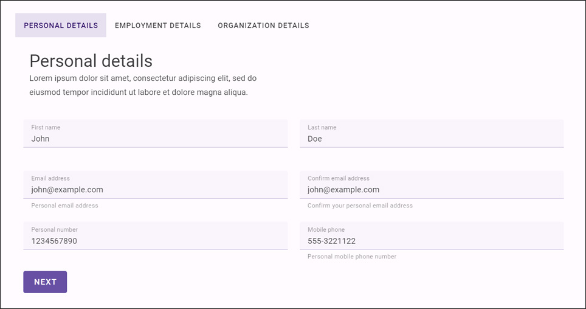

[](https://www.repostatus.org/#wip)

# Onify Blueprint: Helix Showcase - Onboarding

Helix by Onify revolutionizes solution and service development with its intuitive Vue and Vuetify technology. Seamlessly integrated into Onify's ecosystem, it streamlines customer and IT asset management, empowering user-centric interface creation and simplifying complex processes for enhanced productivity and digital innovation.

This Onify Blueprint is an exemplary model that demonstrates an simple but efficient **HR onboarding process**. Designed as a **wizard-style form**, it simplifies data entry by allowing users to search and select from **demo data**, including **employees and departments**, sourced from our extensive index. This example showcases the ease of integrating accurate and compliant data through robust **validation** tools. 

While this adeptly integrates with our **API** to initiate a **BPMN workflow**, it's primarily a template showcasing a fully automated onboarding process. It also features a powerful workspace for employee data management, highlighting our commitment to innovative and efficient digital solutions. This Blueprint serves as an excellent starting point for organizations looking to develop or enhance their onboarding processes, offering a practical, customizable template that embodies streamlined and automated HR operations.



## Requirements

* Onify Hub
* Onify Helix (v0.30.0 or higher)

## Included

* Workflow (employee-onboarding)
* BPMN resource (employee-onboarding.bpmn)
* Options (departments)
* Items (employees)
* Workspace (Employees)
* Helix page (onboarding wizard)

## Setup

### Onify Hub

#### Copy Resources

1. Copy `./hub/resources/*` to Onify Hub resources folder `./resources/`  
2. Sync resources with Git if needed

#### Import items and config

1. Import items (`./hub/import/items.json`) via `POST /api/v2/admin/bulk/items` API endpoint
2. Import configuration (`./hub/import/configuration.json`) via `POST /api/v2/setup/database/config/import` API endpoint 

### Helix App

1. Copy `./helix/*` to your Onify Helix App root folder
2. Add to `onboarding` page to `pages.yml` (see example below)

#### pages.yml

```yml
- name: onboarding
  path: '/onboarding'
  import: '../src/custom/pages/onboarding.vue'
```

## Support

* Community/forum: https://support.onify.co/discuss
* Documentation: https://support.onify.co/docs
* Support and SLA: https://support.onify.co/docs/get-support

## License

This project is licensed under the MIT License - see the [LICENSE](LICENSE) file for details.